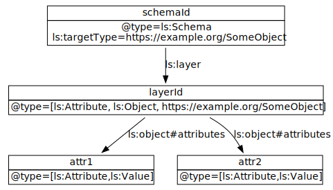

# Layered Schemas

## Introduction

A schema describes the shape of data. An *instance* of a schema is a
data object that conforms to a schema. In general, a schema includes
structural constraints about its instances, not semantic
information. A structurally valid data object can be semantically
inconsistent. Layered schemas define data objects using open-ended
semantic information. This additional information can be used to
validate data objects structurally and allows writing programs that
deal with semantics without hardwiring meaning into algorithms. For
example, a program that removes personally identifiable information
can operate on many types of data by selecting data elements based on
the privacy attributes assigned by the schema, instead of hardcoding
certain fields.

A layered schema has a schema base and layers (overlays) that modify
the information of the base. These layers can be used to add or modify
constraints, semantic tags, processing directives, and other metadata
based on the use case, locale, or implementation. 

A layered schema defines data objects as a labeled property graph. The
same schema can be used to validate a structured object (such as a
JSON or an XML document) and translate it into a labeled propery
graph. The translation process itself can be written as a program that
reads the semantic information embedded into the schema, so it is not
necessarily linked to a particular data format. 


## Basic Concepts

A layered schema itself is a labeled property graph. A minimal layered
schema contains a node with schema information, and another node with
information about the data object that is being defined by the
schema. This can be represented as follows:



```
{
  "@context": "http://layeredschemas.org/ls.jsonld",
  "@type": "Schema", or "Overlay",
  "@id": "http://layeredschemas.org/exampleSchema",
  "targetType": "http://example.org/SomeObject",
  "attributes": [
    {
      "@id": "attribute id",
      "@type": "Value",
      .. // other annotations
    },
    ...
  ]
}
```
Or:

```
{
  "@context": "http://layeredschemas.org/ls.jsonld",
  "@type": "Schema", or "Overlay",
  "@id": "http://layeredschemas.org/exampleSchema",
  "targetType": "http://example.org/SomeObject",
  "attributeList": [
    {
      "@id": "attribute id",
      "@type": "Value",
      .. // other annotations
    },
    ...
  ]
}
```

### `@context`

The layered schemas context is used to expand the schema. This
context defines the expanded terms for the schema attributes and
schema structure. If the schema includes semantic annotations not
defined in this context, additional contexts can be specified as an
array.

### `@type`

This is a `Schema` object. Valid values are:

 * `Schema` or `http://layeredschemas.org/Schema`
 * `Overlay` or `http://layeredschemas.org/Overlay`
 
 Note that this notation declares the JSON-LD node type as a schema or
 overlay.

### `@id`

The schema identifier. The id is usage specific, it can be a
globally unique identifier, or an identifier meaningful for the
domain schema is used in. This identifier can be used to define
references to the schema, and should be unique for the domain.
  
Note that this notation declares the JSON-LD node id as the schema
identifier.
  
### `targetType` 

`@id: http://layeredschemas.org/targetType`<br>
`@type: @id`

The type(s) of the object defined by the schema, or the overlay.
  
A `targetType` is mandatory for a schema. It is optional for an
overlay. An overlay without a `targetType` can be composed with any
other layer.

### `attributes`

`@id: http://layeredschemas.org/Object/attributes`<br>
`@container: @id`<br>

The attributes of the object defined by this schema. It is an idmap,
so attributes can be defined as an array of attributes as a JSON
object. That is, both of the following definitions are valid:

```
"attributes": [
  { 
    "@id": "attr1"
  },
  { 
    "@id": "attr2" 
  },
  ...
]
```

```
"attributes": {
  "attr1": {},
  "attr2": {},
  ...
}
```

The order of attributes are not significant, and not necessarily preserved.

### `attributeList`

`@id: http://layeredschemas.org/Object/attributeList`<br>
`@container: @list`<br>

The attributes of the object defined by this schema. A schema can either have `attributes` or `attributeList`.
`attributeList` is a list container, meaning the ordering of attributes are significant:

```
"attributeList": [
  { 
    "@id": "attr1"
  },
  { 
    "@id": "attr2" 
  },
  ...
]
```
### Expanded Layer Model

Layered schema implementations must work with the following expanded
JSON-LD representation. Below is the model for `Schema`. `Overlay`
uses the same model with the corresponding `@type`:

```
[
  {
    "@type": [
      "http://layeredschemas.org/Schema"
    ],
    "http://layeredschemas.org/targetType": [
      {
        "@id": "objType"
      }
    ],
    "http://layeredschemas.org/Layer/objectVersion": [
      {
        "@value": "objVersion"
      }
    ],
    "http://layeredschemas.org/Object/attributes": [
      {
        "@id": "idValue",
        "@type": [
          "http://layeredschemas.org/Value"
        ]
      },
      {
        "@id": "idObject",
        "@type": [
          "http://layeredschemas.org/Object"
        ],
        "http://layeredschemas.org/Object/attributes": []
      },
      {
        "@id": "idReference",
        "@type": [
          "http://layeredschemas.org/Reference"
        ],
        "http://layeredschemas.org/Reference/reference": [
          {
            "@id": "http://example.org/reference"
          }
        ]
      },
      {
        "@id": "idArray",
        "@type": [
          "http://layeredschemas.org/Array"
        ],
        "http://layeredschemas.org/Array/items": [
          {}
        ]
      },
      {
        "@id": "idComposite",
        "@type": [
          "http://layeredschemas.org/Composite"
        ],
        "http://layeredschemas.org/Composite/allOf": [
          {
            "@list": [
              {}
            ]
          }
        ]
      },
      {
        "@id": "idPolymorphic",
        "@type": [
          "Polymorphic"
        ],
        "http://layeredschemas.org/Polymorphic/oneOf": [
          {
            "@list": [
              {}
            ]
          }
        ]
      }
    ]
  }
]
```

## Attribute Types

### Value

`@type: Value` or `@type: http://layeredschemas.org/Value`

A sequence of bytes. Examples are `string`, `int`, `xs:Date`,
etc. The schema may specify the encoding, format, and architecture
or representation specific type.
  
``` 
{ 
  "@id": "attribute1",
  "@type": "Value" 
}
```

### Object

`@type: Object` or `@type: http://layeredschemas.org/Object`

Key-attribute pairs, similar to a JSON object or an XML element. An
`Object` attribute has `attributes` that list the nested attributes.

```
{
  "@id": "object1",
  "@type": "Object",
  "attributes": {
     "nestedAttr1": {
       "@type": "Value"
     },
     ...
  }
}
```

### Array

`@type: Array` or `@type: http://layeredschemas.org/Object`

An ordered list of attributes. An `Array` attribute has `items` that
specifies the structure of array items. The following example is a
value array.

```
{
  "@id": "array1",
  "@type": "Array",
  "items": {
    "@id": "arrayElementsID",
    "@type": "Value"
  }
}
```
Below is an object array:
```
{
  "@id": "<attributeId>",
  "@type": "Array",
  "items": {
    "@type": "Object",
    "attributes": {
      ...
    }
  }
}
```

### Reference

`@type: Reference` or `@type: http://layeredschemas.org/Reference`

A reference to another object. How this reference is resolved is
implementation dependent. It can be a [strong reference](#strong-reference) that selects a particular schema
variant, or a [weak reference](#weak-reference) that will be resolved at run time
based on the existing context.  The reference can be:

  * a hash value or some other DRI of a schema,
  * an IRI specifying an object, or a particular version of that object,
  * an IRI specifying a schema,
  * or some other identifier that can be resolved to a schema.
  
  
When compiled, the resulting schema will have all `Reference`
attributes replaced with the actual referenced schema.
  
```
{
  "@id": "weakref",
  "@type": "Reference",
  "reference": "http://example.org/ExampleObject"
}
```

This is a weak reference to an `ExampleObject` that will be resolved
based on the current processing context.

```
{
  "@id": "strongref",
  "@type": "Reference",
  "reference": "sha256://748736a7fde293...."
}
```
This is a strong reference that directly addresses a schema variant using its hash.

#### Strong reference

A strong reference to a schema layer or schema resolves to a unique
object. Strong references use a decentralized resource identifier
(DRI) scheme to address the object (usually a hash).

```
{
  "@type": "Schema",
  "targetType": "SomeObject",
  "layers": [
     "sha256:a948904f2f0f479b8f8197694b30184b0d2ed1c1cd2a1ec0fb85d299a192a447"
  ]
}
```

This is a valid reference only if the referenced object is a layer or
another schema, and it has a compatible `targetType`.

Similarly:

```
{
  "@type": "Layer",
  "targetType": "SomeObject",
  "attributes": {
    "attr1": {
       "reference": "sha256:a948904f2f0f479b8f8197694b30184b0d2ed1c1cd2a1ec0fb85d299a192a447"
    } 
  }
}
```

This reference is valid only if it points to a schema. That schema can
be for a different type of object.

#### Weak reference

A weak reference is any kind of reference to another object that can
resolve to multiple objects.

This kind of reference may refer to multiple schemas:

```
{
  "@type": "Schema",
  "targetType": "SomeObject",
  "layers": [
     "http://example.org/SomeObject/layer/v1.2"
  ]
}
```

The schema registry can resolve this link based on its own
configuration. For instance, if a registry allows only unique version
numbers, the above link would resolve to a definite schema. The link
resolution can be dependent on the processing context. For instance,
when processing data in a specific jurisdiction, layers tagged with
that jurisdiction can be selected.


### Composite

`@type: Composite` or `@type: http://layeredschemas.org/Composite`

A composition of multiple attributes. The result of a composition is
an `Object`, so the elements of a composition are limited to `Value`,
`Object`, and `Reference` types.

```
{
  "@id": "compositeAttr",
  "@type": "Composite",
  "allOf": [
     {
       "@id":"part1",
       "@type": "Reference",
       "reference": "http://example.org/SomeObject"
     },
     {
       "@id": "part2",
       "@type": "Object",
       "attributes": {
          "attr1": {
             "@type": "Value"
          },
          "attr2": {
             "@type": "Value
          }
        }
     },
     {
       "@id": "part3",
       "@type": "Value"
     }
  ]
}
```

When compiled, all `Composite` attributes are replaced with `Object`
attributes containing all the attributes of the composite attribute. In
the above example, the `compositeAttr` will be an `Object` containing
all attributes of `SomeObject`, `attr1`, `attr2`, and `part3`.

### Polymorphic

`@type: Polymorphic` or `@type: http://layeredschemas.org/Polymorphic`

A polymorphic type that can be one of the types listed in the
attribute definition. This type of attribute requires constraint
annotations to decide the actual type of the object at
run time.
  
```
{
  "@id": "polyAttr",
  "@type": "Polymorphic",
  "oneOf": [
     {
       "@type": "Reference",
       "reference": "sha256://2566efadfe9843..."
     },
     {
       "@type": "Reference",
       "reference": "sha256://874658d0a9e8f.."
     }
  ]
}
```

This attribute can be one of two types defined by strong
references. When data object is ingested using this schema, the
`polyAttr` attribute will be checked if any one of the options
validate the input data. If one of them validates, then the type is
decided and the selected schema will be used to process the
attribute. If none matches, or more than one option matches, an error
will be raised.


## Schema Manifest

A `SchemaManifest` object defines how a particular variant of a data
object is composed from its layers.

```
{
  "@context": "https://layeredschemas.org/ls.jsonld",
  "@type": "SchemaManifest",
  "@id": "<unique identifier for the schema defined by this manifest>",
  "publishedAt": "<schema publish date>",
  "targetType": "<the object type defined by this schema>",
  "bundle": "<the bundle containing all valid layers and references>",
  "schema": "<reference to the schema">,
  "overlays": [
     "reference to overlay1",
     "reference to overlay2",
     ...
   ]
}
```

### `@type`

The type of this JSON-LD object is a
`http://layeredschemas.org/SchemaManifest`.

### `@id`

The unique ID for this schema variant.

###  `publishedAt`

`@type: http://schema.org/Date`<br>
`@id: http://layeredschemas.org/SchemaManifest/publishedAt`

The schema variant publish date.

### `targetType`

`@type: @id`<br>
`@id: http://layeredschemas.org/targetType`

The type(s) of the object defined by this schema. There can be many
schemas defining different variants of the same data object. 

### `bundle`

`@type: @id`<br>
`@id: http://layeredschemas.org/SchemaManifest/bundle`

Points to a [schema bundle](#schema-bundle) containing 
[strong references](#strong-reference)
for layers and schemas to resolve all [weak references](#weak-reference).

### `schema`

`@type: @id`<br>
`@id: http://layeredschemas.org/SchemaManifest/schema`


Points to the schema. The schema must be of type `Schema` and declare
the same object type as the schema manifest.

### `overlays`

`@type: @id`<br>
`@container: @list` <br>
`@id: http://layeredschemas.org/SchemaManifest/overlays`

An ordered list of layers composing the schema. Each layer must be of
type `Overlay`, and declare a compatible `targetType` as the schema manifest.

### Expanded Schema Manifest Model

Layered schema implementations must work with the following expanded
JSON-LD representation. 

```[
  {
    "@type": [
      "http://layeredschemas.org/SchemaManifest"
    ],
    "http://layeredschemas.org/targetType": [
      {
        "@value": "objType"
      }
    ],
    "http://layeredschemas.org/SchemaManifest/publishedAt": [
      {
        "@value": "20210320T00:00:00Z"
      }
    ],
    "http://layeredschemas.org/SchemaManifest/bundle": [
      {
        "@id": "sha256://27634767a887e887f8e87..."
      }
    ],
    "http://layeredschemas.org/SchemaManifest/schema": [
      {
        "@id": "sha256://5878a8e8faa9890..."
      }
    ],
    "http://layeredschemas.org/SchemaManifest/overlays": [
      {
        "@list": [
          {
            "@id": "sha256://587376a7676f767..."
          },
          {
            "@id": "sha256://ee538866547676f767..."
          }
        ]
      }
    ]
  }
]

```

## Schema Bundle


A schema `Bundle` links a group of schema layers together so the
references to the layers in a schema manifest and references to
objects in schemas can be resolved unambiguously. In other words, a
`Bundle` is a mechanism to convert [weak
references](#weak-reference) into [strong
references](#weak-reference).

```
{
  "@context": "https://layeredschemas.org/ls.jsonld",
  "@type": "Bundle",
  "@id": "<unique identifier for the schema bundle>",
  "references": {
     "weak-reference": "strong-reference",
     "weak-reference": [
          "strong-reference",
          "strong-reference",
          ...
       ]
     }
  }
}
```

### `@type`

The type of this JSON-LD object is a
`http://layeredschemas.org/Bundle`.

### `@id`

The unique ID for this schema bundle.

### `references`

`@id: http://layeredschemas.org/Bundle/references`</br>
`@container: @id`

Specifies one or more [strong references](#strong-reference) for each [weak
reference](#weak-reference).


## Composition 

Composition operation combines layers to create a new variant of a
schema, or to create a new overlay that is a combination of several
overlays. When composing layers, an overlay can be added into a schema or
another overlay. A schema cannot be composed with another schema. 

When composing schema layers, all layers must agree on the
`targetType`. That means, all non-empty target types must have
nonempty intersections. A layer without a target type can be composed
with any layer.

The following are valid compositions:

 * `Schema(object) + Overlay_1 + Overlay_2(object)`
The result is a schema for `object`.
 * `Overlay_1(object) + Overlay_2(Object)`
The result is an overlay for `object`.
 * `Schema(object) + Overlay_1 + Overlay_2(object)`
The result is a schema for object. The first overlay can be composed with the schema because it is not declared for a particular object type. 

### Options

The composition algorithm uses an `options` parameter containing the
following options:

  * `Union = false`: If `false`, only those attributes that exist in
    the target layer will be in the resulting layer. If `true`,
    attributes that are not in the target layer but that exist in the
    source layer will be added to the target layer.
    
### Composing Terms
    
A key part of the algorithm is composing the values of terms included
in the attribute. It should be possible for an implementation to
define terms that specify term-specific composition methods. The
default composition for terms is as follows: Let `A` and `B` be
attributes, and let `A[t]` denote the value of the term `t` in
attribute `A`.

  * If `t` is a `@set`, then the composition of `A[t]` and `B[t]` is
    `A[t] ∪ B[t]`.  Unless otherwise specified, all JSON-LD terms are
    sets. 
  * If `t` is a `@list`, then the composition of `A[t]` and `B[t]` is 
    `A[t] + B[t]`.
  * The schema implementation should support override semantics.
    That is, the composition of `A[t]` and `B[t]` is:
      * `A[t]`, if `B[t]` is nil
      * `B[t]`, if `B[t]` is not nil
      
      
#### Examples

Set/List composition:

```
A: {
  "@id": "attr1",
  "setTerm": [ "a", "b" ],
  "listTerm" : 1
}

B: {
  "@id": "attr1",
  "setTerm": [ "a", "c"],
  "listTerm": [ 1, 2 ]
}

Composition of A and B: {
  "@id": "attr1",
  "setTerm": ["a", "b", "c"],
  "listTerm": [1, 1, 2]
}
```

Override:
```
A: {
  "@id": "attr1",
  "value": "a"
}

B: {
  "@id": "attr1",
  "value": "b"
}

Composition of A and B: {
  "@id": "attr1",
  "value": "b"
}

Composition of B and A: {
  "@id": "attr1",
  "value": "a"
}
```

### Algorithm

In the following algorithm to compute composition of layers, the
`attr.path` refers to the sequence of `@id`s of attributes starting from
the root attribute node to the attribute `attr`.

```
ComposeLayers(options,target,source)
  ComposeTerms(target,source)
  For each sourceAttr in source.attributes processed depth-first
    Find targetAttr such that targetAttr.path has sourceAttr.path as a suffix
    ComposeAttribute(options,targetAttr,sourceAttr)

  If options.Union
    Add all source attributes that are not in target into target
```

This algorithm allows defining overlays that contains only the leaf
nodes without the intermediate steps. For example:
```
{
  "@type": "Schema",
  "attributes": {
    "obj": {
      "@type": "Object",
      "attributes": {
         "nestedAttr": {
            "@type": "Value"
         }
      }
    }
  }
}

{
  "@type": "Overlay",
  "attributes": {
    "nestedAttr": {
      "@type":"Value",
      "descr": "description"
    }
  }
}
```

The `nestedAttr` in the overlay has path `nestedAttr`, which matches
`obj.nestedAttr`, so the composition becomes:

```
{
  "@type": "Schema",
  "attributes": {
    "obj": {
      "@type": "Object",
      "attributes": {
         "nestedAttr": {
            "@type": "Value",
            "descr": "description"
         }
      }
    }
  }
}
```

Same is also true for the following overlay with path `obj.nestedAttr`:

```
{
  "@type": "Overlay",
  "attributes": {
    "obj": {
      "@type": "Object",
      "attributes": {
         "nestedAttr": {
           "@type":"Value",
           "descr": "description"
         }
      }
    }
  }
}
```

The `ComposeAttribute` algorithm computes the composition of all
annotations, and recursively composes nested attributes. The types of
the attributes must agree. An overlay cannot redefine an attribute
using the same id with a different `@type`.

```
ComposeAttribute(options,target,source)
  ComposeTerms(target,source)
  
  switch target.Type:
    Object: ComposeAttributes(options,target.attributes,source.attributes)
    Array: ComposeAttribute(options,target.items,source.items)
    Composite: ComposeAttribute for all matching attributes
    Polymorphic: ComposeAttribute for all matching attributes
```

## Slicing

Slicing operation creates new layers from an existing layer by
selecting a subset of the terms. It uses an `accept` operation that
selects the terms that will be included in the output.

### Algorithm

```
SliceAttribute(attr,accept)
  newAttribute:= new Attribute
  For each (term, value) in attr
    If accept(term)
      newAttribue[term]=value
  
  If attr is one of Object, Array, Composite, Polymorphic
    For each nestedComponent under attr
      SliceAttribute(nestedComponent,accept)
      
  If newAttribute is not empty, return newAttribute
```

### Example

Consider the following layer:
```
"attributes": {
  "attr1": {
     "@type": "Value",
     "format": "url",
     "privacyClassifications": ["PII"]
  },
  "attr2": {
    "@type": "Object",
    "attributes": {
       "attr3": {
         "@type": "Value",
         "privacyClassifications": ["BIT"]
       }
    }
  }
}
```

Slicing this schema with an `accept` function that only accepts
`attributes`, `items`, `allOf`, `oneOf`, and `reference`:

```
"attributes": {
  "attr1": {
     "@type": "Value",
  },
  "attr2": {
    "@type": "Object",
    "attributes": {
       "attr3": {
         "@type": "Value"
       }
    }
  }
}
```

Slicing this schema with an `accept` function that accepts `format`:
```
"attributes": {
  "attr1": {
     "@type": "Value",
     "format": "url",
  }
}
```

Slicing this schema with an `accept` function that accepts `privacyClassifications`:
```
"attributes": {
  "attr1": {
     "@type": "Value",
     "privacyClassifications": ["PII"]
  },
  "attr2": {
    "@type": "Object",
    "attributes": {
       "attr3": {
         "@type": "Value",
         "privacyClassifications": ["BIT"]
       }
    }
  }
}
```
