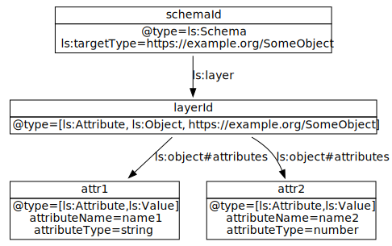

# Layered Schemas - Syntax and Data Model

## Basic Concepts

A layered schema itself is a labeled property graph. A layered schema
with that defines an object with two attributes can be represented as
follows:

(`ls` is an alias for `https://lschema.org/`):


The first node of the schema has the identifier `schemaId`, which is
also the unique identifier of the schema. The type of the node is
`https://lschema.org/Schema`. The `targetType` is defined to be
`https://example.org/SomeObject`, which is the type of the object
defined by this schema. This node is connected to the `layerId` node
using `ls:layer`. That means, the `layerId` node defines a layer, and
since the source node is of type `ls:Schema`, this is a schema
layer. The layer is of type `ls:Object`, `ls:Attribute`, and
`https://example.org/SomeObject`. This means that the defined object
is a schema attribute, as well as an object (a set of key-value
pairs), and `https://example.org/SomeObject`. This schema has two
attributes, `attr1` and `attr2`, both of which are defined as
`ls:Value`, meaning the these attributes are a sequence of bytes, and
can be strings, integers, etc. At this point, the schema does not
define what type of data these attributes are.

This graph can be represented as the following JSON-LD object:

```
{
  "@context": "https://lschema.org/ls.json",
  "@type": "Schema",
  "@id": "schemaId",
  "targetType": "https://example.org/SomeObject",
  "layer": {
    "@id": "layerId",
    "@type": ["Attribute", "Object", "https://example.org/SomeObject"],
    "attributes": [
      {
        "@id": "attr1",
        "@type": ["Attribute", "Value"]
      },
      {
        "@id": "attr2",
        "@type": ["Attribute", "Value"]
      }
     ]
  }
}
```

This is a direct representation of the graph using JSON-LD. Some of
the information in this schema can be inferred. For instance, all
elements of `attributes` have type `Attribute`, so the type definition
for `Attribute` can be omitted. Similarly, any object containing
`attributes` is an `Object`, so it can be omitted as well.

An `Overlay` can be used to assign additional information to this
schema. For instance, the following overlay defined JSON keys and
types for the attributes:

```
{
  "@context": "https://lschema.org/ls.json",
  "@type": "Overlay",
  "@id": "overlayId",
  "targetType": "https://example.org/SomeObject",
  "layer": {
    "@id": "layerId",
    "@type": ["Attribute", "Object", "https://example.org/SomeObject"],
    "attributes": [
      {
        "@id": "attr1",
        "attributeName": "name1",
        "attributeType": "string"
      },
      {
        "@id": "attr2",
        "attributeName": "name2",
        "attributeType": "string"
      }
    ]
  }
}
```

When this overlay is composed with the previous schema, the resulting schema is;
```
{
  "@context": "https://lschema.org/ls.json",
  "@type": "Schema",
  "@id": "schemaId",
  "targetType": "https://example.org/SomeObject",
  "layer": {
    "@id": "layerId",
    "@type": ["Attribute", "Object", "https://example.org/SomeObject"],
    "attributes": [
      {
        "@id": "attr1",
        "@type": ["Attribute", "Value"],
        "attributeName": "name1",
        "attributeType": "string"
      },
      {
        "@id": "attr2",
        "@type": ["Attribute", "Value"],
        "attributeName": "name2",
        "attributeType": "string"
      }
    ]
  }
}
```

Graph representation for this schema is:



This schema can be used to process the following JSON document:

```
{
   "name1": "value1",
   "name2": "value2"
}
```

When this JSON document is ingested using the above schema, the
resulting data model is as follows:


### Schema Variants

Data objects can have variations due to differences in locale,
jurisdiction, API implementation, representation, or conventions. In
such situations a common schema can be used to describe the common
attributes, and different overlays can be used to customize the schema
to a particular variant.

A *schema variant* is a schema combined with zero or more
overlays. The schema of a variant is called a *schema base*. 

For example, FHIR is a standard format used for the exchange of health
data. Even though the data elements are standard, the constraints on
those elements differ from jurisdiction to jurisdiction. Certain
required attributes in a jurisdiction can be optional in
another. These are represented using FHIR profiles. The FHIR schema
can be defined as a layered schema, with jurisdictional profiles
represented as overlays overriding the common constraints for a
particular locale. The resulting schema is a variant of the FHIR
schema with different constraints.

Similarly, a schema can be used to generate data entry
forms. Different overlays can be used to configure the presentation
layer using different languages.

### Data Model

A **layer** is a **schema** or an **overlay**. The canonical data
model a layer is a labeled directed graph, thus, there are multiple
representations of it. Using JSON-LD, the structure of a layer looks
like this:

```
{
  "@id": "layerId",
  "@type": "https://lschema.org/Schema",
  <em>layer metadata</em>
  "https://lschema.org/layer": {
     <em>layer specification</em>
   }
}
```

This declares a `Schema` with id `layerId`. Any layer metadata can be
included in this header section. This metadata will be preserved by
the composition and slicing algorithms. The actual layer specification
is given in the `https://lschema.org/layer` object.

The equivalent labeled property graph representation is as follows:


### Layer specification

The *layer specification* is the data model of the object that is
being defined by the schema or that is being modified by the
overlay. The *layer specification* lists the *attributes* and the
associated metadata. Each *attribute* is uniquely identified within
the layer using an `@id`. Each *attribute* has one or more `@type`s
that specify the stucture of the attribute. These `@type`s determine
the structure of the data (value, object, array, etc.), not the
interpretation of its contents (string, int, etc.).

#### Value type

A *Value* is simply a string of bytes whose content will be
interpreted by a program. The actual underlying value may have parts
when interpreted (such as a date field with year, month, day parts),
but as long as the schema processing is concerned, the *Value* field
is atomic.

A value attribute is declaret in JSON-LD using:

```
{
   "@id": "attributeId",
   "@type": "Value",
   <em>attribute metadata</em>
}
```

When processed, this is expanded to:

```
{
   "@id": "attributeId",
   "@type": ["https://lschema.org/Attribute", "https://lschema.org/Value"],
   <em>attribute metadata</em>
}
```

The type `Value` also implies the type `Attribute`.

Note that the layered schema does not necessarily contain any
information about the underlying data type. A `Value` attribute is
simply a sequence of bytes. Additional layers may define semantic
metadata that denote a more conventional type (such as `string`), but
how the underlying data is interpreted is up to the program using the
schema.


#### Object type

An *Object* contains a set of named attributes. An object can be used
to represent a JSON object containing key-value pairs, or an XML
element containing other elements.

An object has unorderd `attributes`, or ordered `attributeList`. An
object attribute is declared in JSON-LD using:

```
{
   "@id": "attributeId",
   "@type": "Object",
   <em>attribute metadata</em>
   "attributes": {
     "unordered_attribute_1": {...},
     "unordered_attribute_2": {...},
     ...
   },
   "attributeList": [
      { "@id": "ordered_attribute_1", ... },
      { "@id": "ordered_attribute_2", ... },
      ...
   ]
}
```

When processed, this is expanded to:

```
{
   "@id": "attributeId",
   "@type": [ "https://lschema.org/Attribute", "https://lschema.org/Object"],
   <em>attribute metadata</em>
   "https://lschema.org/Object#attributes": [
     { "@id": "unordered_attribute_1" },
     { "@id": "unordered_attribute_2" },
     ...
   ],
   "https://lschema.org/Object#attributeList: [
     { "@id": "ordered_attribute_1", ... },
     { "@id": "ordered_attribute_2", ... },
     ...
   ]
}
```

Note that the type `Object` also implies the type
`Attribute`. Furthermore, if an attribute is defined without an
explicit `@type`, but includes `https://lschema.org/Object#attributes`
or `https://lschema.org/Object#attributeList`, then the processor
assumes that the attribute is of type `Object`.

The term `attributes` expands to
`https://lschema.org/Object#attributes` as an `@idmap`. It specifies
the attributes of the object in an unordered manner, similar to a JSON
object. When processing data, the attributes defined in the
`https://lschema.org/Object#attributes` are matched to the schema
definition ignoring the order they appear.

The term `attributeList` expands to
`https://lschema.org/Object#attributeList` as a `@list`. It specifies
the attributes of the object in the given order, similar to an XML
element containing other elements with a specified order. The
`attributeList` only specifies a ranking between the defined elements,
that is there can be additional attributes not specified in the
`attributeList` in between the ordered elements. For example, if a
schema is defined using ordered attributes `a b c d`, then the input
containing attributes `y a b x c w d` conforms to that schema.

#### Array type

An `Array` contains repeated attributes. Array attributes can be used
to represent JSON arrays, or XML elements (an XML element containing
other elements can be represented as both an object and an array). The
array definition contains the attribute specification for the array items:

```
{
   "@id": "arrayAttributeId",
   "@type": "Array",
   <em>Array metadata</em>,
   "items": {
      "@id": "arrayItemsId",
      "@type": "Value",
      <em>item metadata</em>
   }
}
```


The array items is an attribute definition, and can be of any
type. Multi-dimensional arrays are supported by defining arrays whose
items are other arrays.

When processed, this is expanded to:

```
{
   "@id": "arrayAttributeId",
   "@type": [ "https://lschema.org/Attribute", "https://lschema.org/Array"],
   <em>Array metadata</em>,
   "https://lschema.org/Array#items": {
      "@id": "arrayItemsId",
      "@type": [ "https://lschema.org/Attribute", "https://lschema.org/Value"],
      <em>item metadata</em>
   }
}
```

The `Array` type implies the `Attribute` type. If an attribute is
defined without an explicit `Array` type but contains
`https://lschema.org/Array#items`, then `Array` type is added during
processing.

#### Reference type

A `Reference` points to another schema. How this reference is resolved
is implementation dependent. It can be a strong reference that selects
a definite schema variant, or a weak reference that selects a schema
based on the context. The reference can be:

  * a hash value or some other DRI of a schema,
  * an IRI specifying an object, or a particular version of that object,
  * an IRI specifying a schema,
  * or some other identifier that can be resolved to a schema.
  
When compiled, the resulting schema will have all `Reference`
attributes replaced with the actual referenced schema.

```
{
   "@id": "referenceAttributeId",
   "@type": "Reference",
   <em>Reference metadata</em>
   "reference": "reference to a schema variant"
}
```

When processed, this is expanded to:

```
{
   "@id": "referenceAttributeId",
   "@type": ["https://lschema.org/Attribute", "https://lschema.org/Reference"],
   <em>Reference metadata</em>
   "https://lschema.org/Reference#reference": "reference to a schema variant"
}
```


#### Composite type

A `Composite` attribute is a composition of other attributes. When a
schema containing composite attributes is compiled, all such
attributes are converted into `Object`s by combining the contents of
its components.

A composite attribute is defined as:

```
{
   "@id": "compositeAttibuteId",
   "@type": "Composite",
   <em>attribute metadata</em>,
   "allOf": [
     {attr1},
     {attr2},
     ...
   ]
}
```

When processed, this is expanded to:

```
{
   "@id": "compositeAttibuteId",
   "@type": ["https://lschema.org/Attribute", "https://lschema.org/Composite"],
   <em>attribute metadata</em>,
   "https://lschema.org/Composite#allOf"": [
     {attr1},
     {attr2},
     ...
   ]
}
```

When the schema is compiled, the elements under `allOf` term are
combined to form a new object. For the input:

```
{
   "@id": "compositeAttributeId",
   "@type": "Composite",
   "allOf": [
     {
       "@type": "Object",
       "attributes": {
          <em>object attributes</em>
       }
     },
     {
       "@type": "Value",
       "@id": "valueId"
     },
     {
       "@type": "Array",
       "items": {
          <em>array items</em>
       }
     }
   ]
}
```
The output is:
```
{
   "@id": "compositeAttributeId",
   "@type": "Object",
   "attributes": {
      <em>object attributes</em>
     {
       "@type": "Value",
       "@id": "valueId"
     },
     {
       "@type": "Array",
       "items": {
          <em>array items</em>
       }
     }
   }
}
```

If there are any nested `Reference` or `Composite` attributes in a
`Composite` attributes, those are processed first.

### Polymorphic type

A `Polymorphic` attribute can be one of the types of attributes listed
in its definition. A polymorphic attribute requires constraints to
decide the actual type of the object at run time.
  
```
{
  "@id": "polyAttributeId",
  "@type": "Polymorphic",
  "oneOf": [
     {
       "@type": "Reference",
       "reference": "sha256://2566efadfe9843..."
     },
     {
       "@type": "Object",
       "attributes": {
         ...
       }
     }
  ]
}
```

When processed, this is expanded to:

```
{
  "@id": "polyAttributeId",
  "@type": [ "https://lschema.org/Attribute", "https://lschema.org/Polymorphic"],
  "https://lschema.org/Polyorphic#oneOf": [
     {
       "@type": [ "https://lschema.org/Attribute", "https://lschema.org/Reference"],
       "https://lschema.org/Reference#reference": "sha256://2566efadfe9843..."
     },
     {
       "@type": [ "https://lschema.org/Attribute", "https://lschema.org/Object"],
       "https://lschema.org/Object#attributes": {
         ...
       }
     }
  ]
}
```

This attribute can be one of two types defined by the reference or the
object. When a data object is ingested using this schema, the
corresponding input will be checked if any one of the options validate
the input data. If one of them validates, then the type is decided and
the selected schema will be used to process the attribute. If none of
the options validate the schema, or more than one option matches, an
error will be raised.


## Schema Manifest

A `SchemaManifest` defines how a particular variant of a data object
is composed from its layers.

```
{
  "@context": "https://lschema.org/ls.json",
  "@type": "SchemaManifest",
  "@id": <em>unique identifier for the schema variant defined by this manifest</em>,
  "targetType": <em>the object defined by the schema</em>,
  "bundle": <em>the bundle containing all valid layers and references</em>,
  "schema": <em>reference to the schema</em>,
  "overlays": [
     <em>reference to overlay1</em>,
     <em>reference to overlay2</em>,
     ...
   ]
}
```

When processed, this becomes:
```
{
  "@type": ["https://lschema.org/SchemaManifest]",
  "@id": <em>unique identifier for the schema variant defined by this manifest</em>,
  "https://lschema.org/targetType": <em>the object defined by the schema</em>,
  "https://lschema.org/SchemaManifest#bundle": <em>the bundle containing all valid layers and references</em>,
  "https://lschema.org/SchemaManifest#schema": <em>reference to the schema</em>,
  "https://lschema.org/SchemaManifest#overlays": [
     <em>reference to overlay1</em>,
     <em>reference to overlay2</em>,
     ...
   ]
}
```

The `targetType` specifies the object that is being defined by the
schema. There can be many schema manifests defining different variants
of the same data object.

The `bundle` points to a *schema bundle* containing strong references
for all layers and schemas that should be used to compile the schema.

The `schema` points to the schema base. The schema must be of type
`Schema` and declare the same object type as the schema manifest.

The `overlays` is an ordered list of layers composing the schema. Each
layer must be of type `Overlay`, and declare a compatible `targetType`
as the schema manifest.


## Schema Bundle

A schema `Bundle` links a group of schema layers together so the
references to the layers in a schema manifest and references to
objects in schemas can be resolved unambiguously. In other words, a
`Bundle` is a mechanism to convert weak references to strong
references.

```
{
  "@context": "https://layeredschemas.org/ls.json",
  "@type": "Bundle",
  "@id": <em>unique identifier for the schema bundle</em>",
  "references": {
     <em>weak-reference</em>: <em>strong-reference</em>,
     <em<weak-reference</em>: [
          <em>strong-reference</em>,
          <em>strong-reference<em>,
          ...
       ]
     }
  }
}
```

Each element of `references` specifies one or more strong
references for each weak reference.

